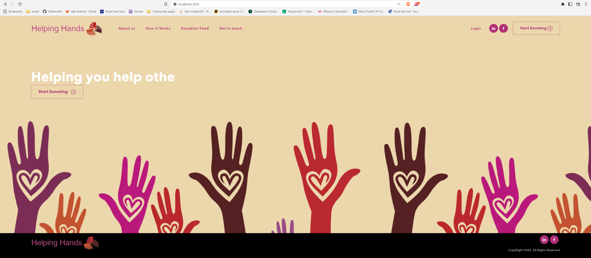

# Helping Hands

## Table of Contents 
- [Description](#description)
- [Licensing info](#license)
- [Questions + Contact](#questions)
- [Demo](#demo)

## Demo

## Description
Helping hands purpose is intended for helping those in need, by donating unused items through our charity app.

## User Story

AS a User, who enjoys helping other people
 
I WANT a platform to be able to help people connect, to help other people that may have less than us.
 
SO THAT we can help them get some essential items they may not have, but need, or may not need but can't afford
 
 
WHEN I visit the site, THEN have options to click the about us, how it works, donation feed and start donating button
 
When I click on the about page, THEN get a bio of the company
 
WHEN I click how it works, THEN i get a small walkthrough about what happens after you hit the donation button
 
WHEN I click donation feed, THEN I can see who else has donated and what they have donated
 
WHEN I click the donate button, if not logged in taken to login page, otherwise THEN im taken to the “donate page”
 
WHEN I view the donate page, THEN i am presented with a form to donate items
 
WHEN i click contact, THEN i am able to fill in my information to contact the website

## Installation Instructions
Start by cloning the repository to your local machine
   
 open the folder in VScode (or a coding app similiar) 
   
 in the console, type npm install 
   
 type: npm start to run the app

## Usage Information
Spreading the word, helping those in need

## License

 
[License information](https://opensource.org/licenses)

## Questions
feel free to contact me, for any questions or improvements you may think of
 
Visit our GitHub profile here: [Jake Roberts](https://github.com/JRoberts94)
 
Visit our GitHub profile here: [Olivia Orme](https://github.com/njenkins2727)
 
Visit our GitHub profile here: [Nathan Jenkins](https://github.com/inspirewh)
 

## Deployed
[Deployed Site]()

## Technology used
javascript   node   react   MUI library   emailjs-com   (for a full list checkout the package.json file )